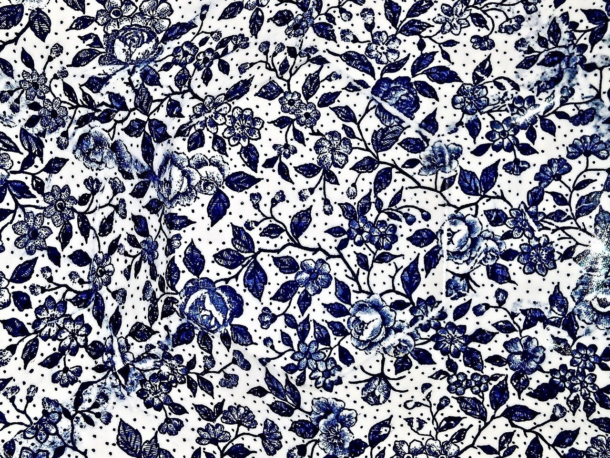

<h1>Работа с текстурами - примеры</h1>

Показываю на примере размытия по Гауссу

Создадим новый класс для нашего блюра. 

gauss_blur_precise.h
```c++
#pragma once
#include "tinyEngine/texture.h"

class GaussFilter
{
public:
  GaussFilter(float sigma, float precision = 0.003);
  ~GaussFilter();
  void perform_gauss_blur(Texture &t);
```

Вычисляем ядро фильтра Гаусса с заданной сигмой, ограничиваем его размер по уровню точности

gauss_blur_precise.cpp
```c++
std::vector<float> get_1d_gaussian_filter(float sigma, float precision)
{
  std::vector<float> kernel;
  int max_kernel_size = 16;
  float step = 0.001;
  while (kernel.size() < max_kernel_size)
  {
    double val = 0.0;

    //numerically integrate normal distribution PDF
    for (double x = kernel.size() - 0.5; x<kernel.size() + 0.5; x+=step)
    {
      val += step*gaussian(sigma, x);
    }
    if (val > precision || kernel.empty())
      kernel.push_back(val);
    else
      break;
  }

  //normalize our kernel
  double norm = kernel[0];
  for (int i=1;i<kernel.size();i++)
    norm += 2*kernel[i];
  for (float &val : kernel)
    val/=norm;
  
  return kernel;
}

```

Теперь приступаем к созданию алгоритма с помощью шейдеров. Для него нам понадобятся - FrameBuffer, Shader Storage Buffer Object (чтобы передать ядро на GPU) и вспомогательная текстура, а также шейдер блюра. Все это будет лежать в нашем классе.

gauss_blur_precise.h
```c++
class GaussFilter
{
public:
  GaussFilter(float sigma, float precision = 0.003);
  ~GaussFilter();
  void perform_gauss_blur(Texture &t);
private:
  std::vector<float> kernel;//1D gauss kernel
  Texture tmp_tex;//intermediate texture
  GLuint fbo;//frame buffer, tmp_tex and buffer will be attached to it
  GLuint kernel_buf;//buffer where kernel values will be stored
  PostFx blur;//postfx that contains blur shader (it applies shader to a full-screen quad with texture)
};
```

Нам потребуется несколько includ'ов из tinyEngine -
resources для создания FBO и SSBO, engine для менеджера текстур
graphics_utils для проверки созданного FBO

```c++
#include "gauss_blur_precise.h"
#include "tinyEngine/resources.h"
#include "tinyEngine/engine.h"
#include <vector>
```


Все, кроме временной текстуры, создаем в конструкторе. Для создания временной текстуры нужно знать размеры текстуры обычной.

```c++
GaussFilter::GaussFilter(float sigma, float precision):
blur("gaussian_blur_precise.fs")
{
  //check if parameters valid
  assert(sigma>0);
  assert(precision>0);

  //create kernel
  kernel = get_1d_gaussian_filter(sigma, precision);

  //create FBO and SSBO
  fbo = create_framebuffer();
  kernel_buf = create_buffer();

  //bind FBO
  glBindFramebuffer(GL_FRAMEBUFFER, fbo);
  
  //SSBO always has padding of 16 bytes, so we should use vec4 for every float
  std::vector<glm::vec4> kernel_pad;
  for (float &val : kernel)
    kernel_pad.push_back(glm::vec4(val,0,0,0));
  //fill SSBO and bind it
  glBindBufferBase(GL_SHADER_STORAGE_BUFFER, 0, kernel_buf);
  glBufferData(GL_SHADER_STORAGE_BUFFER, sizeof(glm::vec4)*kernel_pad.size(), kernel_pad.data(), GL_STATIC_DRAW);
  glBindBufferBase(GL_SHADER_STORAGE_BUFFER, 0, 0);

  glMemoryBarrier(GL_ALL_BARRIER_BITS);

  //check if FBO valid
  if (glCheckFramebufferStatus(GL_FRAMEBUFFER) != GL_FRAMEBUFFER_COMPLETE)
    print_FB_status(glCheckFramebufferStatus(GL_FRAMEBUFFER));
  
  //unbind FBO
  glBindFramebuffer(GL_FRAMEBUFFER, 0);
}
```

Отдельно отмечу создание PostFx шейдера. Он требует названия фрагментного 
шейдера из папки shader. Класс PostFx является оберткой над шейдером, который 
применяется ко всем пикселям текстуры. Его использование показано ниже
```c++
blur("gaussian_blur_precise.fs")
```

Создаем временную текстуру. Так создается пустая текстура заданного размера.
Она имеет формат RGBA8 и тип GL_TEXTURE_2D и не инициализирована
Класс Texture является по сути умным указателем на реальную текстуру внутри
менеджера. Его можно быстро копировать и передавать и обычно не требуется 
явно удалять текстуру - когда на какую-то реальную текстуру не останется 
ссылок в виде Texture,она будет удалена сама
```c++
void GaussFilter::perform_gauss_blur(Texture &t)
{
  //check texture type
  assert(t.type == GL_TEXTURE_2D);

  //if we don't have tmp texture or it has wrong size, we need to recreate it
  if (!tmp_tex.is_valid() || tmp_tex.type != t.type || 
      tmp_tex.get_H() != t.get_H() || tmp_tex.get_W() != t.get_W())
  {
    tmp_tex = engine::textureManager->create_texture(t.get_W(), t.get_H());
  }
```

Устанавливаем используемые текстуры и буферы
```c++
//bind FBO and SSBO
  glBindFramebuffer(GL_FRAMEBUFFER, fbo);
  glBindBufferBase(GL_SHADER_STORAGE_BUFFER, 0, kernel_buf);

  //first pass from t to tmp_tex
  glFramebufferTexture2D(GL_FRAMEBUFFER, GL_DEPTH_ATTACHMENT, GL_TEXTURE_2D, 0, 0);
  glFramebufferTexture2D(GL_FRAMEBUFFER, GL_COLOR_ATTACHMENT0, GL_TEXTURE_2D, tmp_tex.texture, 0);
  glViewport(0, 0, t.get_W(), t.get_H());
```

Теперь посмотрим на сам шейдер. KernelBuf задает наш SSBO с ядром фильтра Гаусса.
binding=0 означает 0 слот, и должен соответствовать второму аргументу glBindBufferBase. Имя буфера и переменной может быть любым. Подробнее про SSBO можно почитать в интернете

```glsl
#version 430

layout(std140, binding=0) readonly buffer KernelBuf
{
  vec4 kernel[];
};

in vec2 ex_Tex;
uniform sampler2D tex;
uniform int pass;
uniform int steps;
uniform vec2 tex_size;
out vec4 fragColor;

void main(void) 
{
    vec4 res = vec4(0, 0, 0, 0);
    ivec2 pixel_coords = ivec2(tex_size*ex_Tex);
    if (pass == 0)
    {
      for (int i = -steps; i <= steps; i++)
        res += texelFetch(tex, clamp(pixel_coords + ivec2(i, 0),ivec2(0,0),ivec2(tex_size)), 0) * kernel[abs(i)].x;
    }
    else
    {
      for (int i = -steps; i <= steps; i++)
        res += texelFetch(tex, clamp(pixel_coords + ivec2(0, i),ivec2(0,0),ivec2(tex_size)), 0) * kernel[abs(i)].x;
    }
    fragColor = res;
}

```

Теперь смотрим на вызов шейдера из c++ кода. У PostFX есть два основных метода
use() и render(). Между ними надо установить все текстуры и униформы в соответствующий шейдер. А до того - выставить SSBO и Render Target
```c++
 //start use postfx
  blur.use();

  //postfx has shader inside. Set textures and uniforms to it. 
  blur.get_shader().texture("tex", t);
  blur.get_shader().uniform("pass",0);
  blur.get_shader().uniform("steps",(int)(kernel.size()-1));
  blur.get_shader().uniform("tex_size",glm::vec2(t.get_W(), t.get_H()));

  //call shader for a full-texture pass
  blur.render();

  glMemoryBarrier(GL_ALL_BARRIER_BITS);

  //second pass from tmp_tex to t
  glFramebufferTexture2D(GL_FRAMEBUFFER, GL_DEPTH_ATTACHMENT, GL_TEXTURE_2D, 0, 0);
  glFramebufferTexture2D(GL_FRAMEBUFFER, GL_COLOR_ATTACHMENT0, GL_TEXTURE_2D, t.texture, 0);
  glViewport(0, 0, t.get_W(), t.get_H());

  blur.use();
  blur.get_shader().texture("tex", tmp_tex);
  blur.get_shader().uniform("pass",1);
  blur.get_shader().uniform("steps",(int)(kernel.size()-1));
  blur.get_shader().uniform("tex_size",glm::vec2(t.get_W(), t.get_H()));
  blur.render();

```

Наш код готов, теперь надо его протестировать. Для этого проще всего добавить тестовый код в sandbox.cpp, функция sandbox_main

Для ускорения работы sandbox не инициализирует ядро программы, а без этого не доступен текстурный менеджер. Так что сделаем это сами.
```c++
  // we don't init engine in sandbox, so need to init textures manager
  View view;
  view.lineWidth = 1.0f;
  view.init("Procedural Tree", 256, 256);
  engine::view = &view;

  Block textures_list;
  TextureManager textureManager = TextureManager("./resources/textures/", textures_list);
  engine::textureManager = &textureManager;
```
Теперь загружаем нашу текстуру с диска из папки "resources/textures/"

```c++
  Texture t = engine::textureManager->load_unnamed_tex(image::base_img_path + "porcelain.jpg");
```

Создаем Гауссовый фильтр и применяем его к текстуре
```c++
  GaussFilter gf(1.0f);
  gf.perform_gauss_blur(t);
```

И сохраняем результат в saves/porcelain_1.png
```c++
  engine::textureManager->save_png(t, "porcelain_1");
```

Получаем что-то такое
Было

Стало
